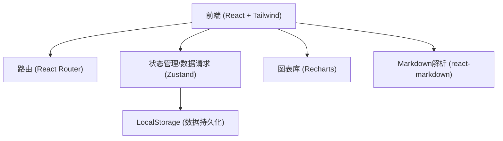
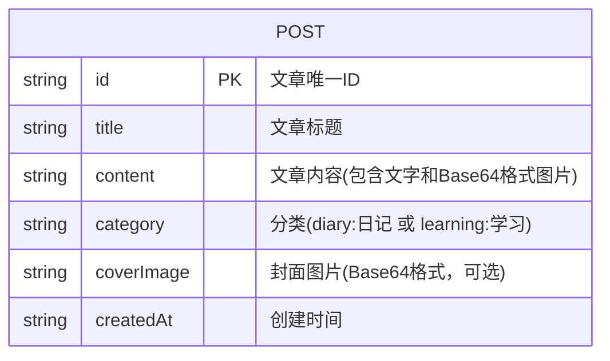

## 1. 架构设计

## 2. 技术说明
- 前端框架：React@18 + tailwindcss@3 + vite
- 路由：react-router-dom
- 图表库：recharts (用于可视化统计图表)
- Markdown/富文本：react-markdown, remark-gfm
- 图标库：lucide-react
- 状态管理与存储：采用 Zustand 结合 LocalStorage 进行数据持久化，模拟后端存取。支持文字和 Base64 图片上传，实现完全纯前端的博客体验。

## 3. 路由定义
| 路由 | 目的 |
|-------|---------|
| / | 首页，展示个人概览、统计图表和最新动态 |
| /posts | 内容列表页，展示所有日记和学习记录 |
| /post/:id | 详情页，展示单篇文章的图文内容 |
| /editor | 发布页，用于撰写文字、上传图片并发布 |

## 4. 数据模型
由于本项目为纯前端实现，以下为 Zustand 状态和 LocalStorage 中存储的数据结构。

### 4.1 数据模型定义

### 4.2 存储结构
- `posts`: Array of POST objects
- 图片上传机制：通过 HTML5 FileReader API 将用户上传的图片转换为 Base64 字符串，直接插入到文章内容中或作为封面存储在 LocalStorage 内。
