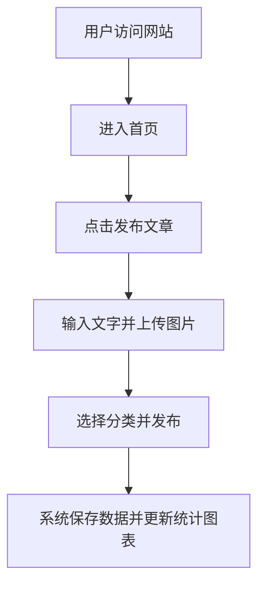

## 1. 产品概述
这是一款专为个人设计的博客系统，主要用于记录个人日记和学习历程。
- 核心目的是提供一个私密或半公开的空间，方便用户进行文字记录、图片上传，并通过可视化图表直观展示个人的创作和学习统计数据。
- 产品的目标是打造一个兼具功能性和高颜值、具有现代设计感的个人知识与生活管理中心。

## 2. 核心功能

### 2.1 用户角色
| 角色 | 注册方式 | 核心权限 |
|------|---------------------|------------------|
| 博主 | 预设账号或直接使用 | 发布文章、上传图片、查看统计、管理所有内容 |
| 访客 | 无需注册 | 浏览公开的日记和学习记录 |

### 2.2 功能模块
1. **首页 (Dashboard)**: 个人简介、最新日记与学习记录列表、数据统计可视化图表（如贡献热力图、分类占比）。
2. **发布页 (Editor)**: 沉浸式编辑器，支持文字排版和图片上传。
3. **内容列表页 (Posts)**: 分类查看日记或学习记录，支持标签过滤。
4. **详情页 (Detail)**: 文章阅读、图片展示。

### 2.3 页面详情
| 页面名称 | 模块名称 | 功能描述 |
|-----------|-------------|---------------------|
| 首页 | 概览区 | 展示个人信息、座右铭及核心导航 |
| 首页 | 统计图表区 | 可视化展示文章发布统计、学习/日记分类饼图或柱状图 |
| 首页 | 最新动态区 | 展示最近发布的几篇文章摘要 |
| 发布页 | 编辑器 | 支持文本输入，提供图片上传按钮 |
| 发布页 | 元数据设置 | 设置文章标题、分类（日记/学习记录） |
| 内容列表页| 列表区 | 按时间倒序排列文章 |
| 详情页 | 正文区 | 优雅的排版展示图文内容 |

## 3. 核心流程
用户可以通过导航栏进入发布页。在发布页输入标题，撰写正文（可上传图片），选择分类（日记/学习），最后点击发布。发布成功后，首页的统计图表自动更新，同时文章会展示在最新动态和内容列表页中。

## 4. 用户界面设计
### 4.1 设计风格
- 主色调与辅助色：采用极致简约的黑白灰搭配强调色（如极简主义的克莱因蓝或质感的墨绿色），打造高级、现代的编辑感（Editorial style）。
- 按钮风格：圆角矩形，悬浮时有柔和的阴影和轻微的平滑过渡动画。
- 字体与大小：标题采用粗体无衬线字体，正文采用易读的字体，字号适中，行距充足（1.6-1.8），留白丰富。
- 布局风格：采用现代化的卡片式布局和不对称网格，打破常规的死板对称，视觉中心突出。
- 动效：页面加载时有平滑的淡入动画，图表加载时有丝滑的展开动画。

### 4.2 页面设计概览
| 页面名称 | 模块名称 | UI 元素 |
|-----------|-------------|-------------|
| 首页 | 统计区 | 采用优雅的极简风格图表组件 |
| 发布页 | 编辑器区 | 沉浸式写作体验，无边框输入框，工具栏简约 |
| 列表页 | 文章卡片 | 大面积留白，标题加粗，图片采用独特的圆角或裁切处理 |

### 4.3 响应式设计
桌面端优先设计，同时完美适配移动端。移动端导航自动折叠为汉堡菜单，图表在小屏幕上自动适配缩放。
